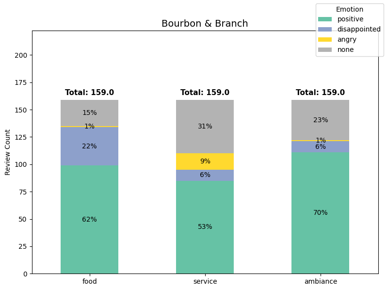

# Yelp Restaurant Review Scorer

## Project Overview

This code notebook processes Yelp restaurant reviews with a **locally hosted LLM** to extract **aspect-based emotions**:

* **Reviewed aspects:** food, service, and ambiance
* **Possible emotions:** positive, disappointed, and angry (or none, where the reviewer does not remark)

### Why process Yelp review text using an LLM?
Yelp could implement additional review steps for each reviewer to document their emotions, but LLM-based characterization is better because:

* Forced scoring is inconsistent or unreliable; a reviewer might input 5 stars but express mixed feelings in text
* Additional steps add friction that could prevent review completion
* Reviewers are free to say what they think without having to conform to review frameworks

---

## Workflow Steps

- **Data preprocessing**  
  - Subsamples the Yelp dataset (>5 GB) into a manageable working set.  
  - Cleans review text (ampersands → “and”, escape characters, accented letters).  

- **LLM classification pipeline**  
  - Builds a reusable prompt and sends batches of reviews to the LLM.  
  - Parses messy JSON-like output into structured DataFrames.  
  - Supports **reprocessing**: when invalid outputs occur, reviews are reprocessed.t

- **Visualization (stacked bar charts)**  
  - Aggregates reviews by emotional response to each aspect, per restaurant.
  - Shows a prototype visualization that could be published to Yelp's website.

- **Quality monitoring**  
  - Tracks reprocessing statistics to measure LLM reliability.  
  - In testing, <1% of outputs required retries.

---

## 🛠 Installation & Setup

### 1. Install Ollama
This notebook uses a local instance of an LLM, which requires Ollama. Download and install Ollama for your OS:

- **macOS / Windows** → [https://ollama.ai](https://ollama.ai)  
- **Linux** →  
    ```
    bash
    curl -fsSL https://ollama.com/install.sh | sh
    ```

### 2. Pull a model

  ```
  bash
  ollama pull mistral
  ```

(Default: `mistral`, but `llama2` and others are supported.)

### 3. Clone this repo
  ```
  bash
  git clone https://github.com/your-username/review-scorer.git
  cd review-scorer
  ```

### 4. Create a virtual environment
  ```
  bash
  python3 -m venv .venv
  source .venv/bin/activate  # Windows: .venv\Scripts\activate
  pip install -r requirements.txt
  ```

### 5. (Optional) Download the Yelp Open Dataset
* If you like, download the complete [Yelp Open Dataset](https://business.yelp.com/data/resources/open-dataset/)
* This is optional because an extract of the dataset has been provided for you in `dataset/` within this repo

---

## Usage

1. **Start Ollama** in a separate terminal:

   ```
   bash
   ollama serve
   ```

2. **Open the notebook**:

   ```
   bash
   jupyter lab review_scorer.ipynb
   ```

3. **Execute the notebook** to process and visualize review content


---

## Real Model Outputs
The model output helps users to select restaurants for their needs and set their expectations:

* **Bourbon & Branch**<br>
Consider this bar for a fancy date or formal event afterparty<br>
</img><br><br>

* **Sher-e-Punjab**<br>
Bring your family for a casual evening of amazing cuisine and unpretentous atmosphere<br>
</img><br><br>

* **Copabanana**<br>
If you're going to go here, be prepared to exercise patience with the staff<br>
</img><br><br>


---

## 📂 Project Structure

```
review-scorer/
│── dataset/                # Yelp dataset sample
│── review_scorer.ipynb     # Analytics notebook
│── requirements.txt        # Python dependencies
│── README.md               # This file
```

---

## 🛣️ Roadmap

* Add support for additional models (e.g., Llama 3, Hermes).
* Integrate embeddings + classifier for validation vs. LLM.
* Build a web dashboard (Streamlit/FastAPI).
* Containerize with Docker for reproducibility.

---

## 🤝 Contributing

PRs welcome. Open an issue for discussion first.

---

## 📜 License

MIT License — see [LICENSE](LICENSE).

```

---

Would you like me to also **insert placeholders for actual plots** (e.g. ``) so GitHub renders visual results immediately? That usually makes READMEs much more engaging.
```
